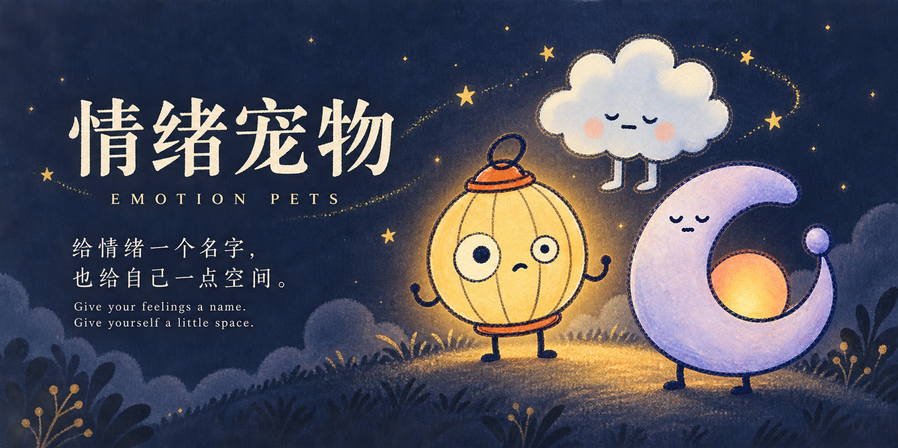

[简体中文](README.md) · **English**

### [Try Emotion Pets →](https://emotion-pet-app.pages.dev/)

No account needed · Chinese & English · Local storage · Open for feedback

## Why I made this

Sometimes, a feeling arrives before I even notice it.

It might begin with something small, or just a passing thought. By the time I realize what is happening, I am already caught up in it. I cannot quite name the feeling or work out how to respond. Over time, those moments can build up, leaving me feeling weighed down and low.

I started wondering: could there be a gentler way to recognize what is happening before I get carried away?

Not to fix it immediately. Not to make myself feel happy. Just to pause and say:

> Oh, this feeling is here again.

That is where Emotion Pets began.

## A name and a shape for what you feel

You can give a familiar feeling a name and choose a character that feels right for it. What it means is yours to decide. There is no correct answer.

When it returns, you may find it easier to recognize. A tap saves that moment. Add a few words if you want—or leave it there.

I hope it can offer a small reminder: you can feel an emotion and notice it, without having to follow it immediately.

There are no daily streaks to maintain, and no need to explain everything.

  
  
  

Watch a gentle capture (expand for animation)

*Screenshots and animation show version 1.0.1 in Chinese, using fictional records. The app also offers English. Example names are not fixed character identities.*

## The psychology behind the design

The design draws on **Acceptance and Commitment Therapy (ACT)** and its focus on psychological flexibility: being present, staying open to internal experiences, and choosing actions guided by personal values, rather than making the elimination of feelings the sole goal.[¹](https://contextualscience.org/act)

- **Present-moment awareness and acceptance:** noticing emotions, thoughts, and bodily sensations without rushing to judge or suppress them.
- **Cognitive defusion:** recognizing “I am having a thought” without automatically treating it as a fact or a command. Naming and visualizing an experience are used here as an interface metaphor for observation.[²](https://contextualscience.org/about_act)
- **Affect labeling:** putting feelings into words. Experimental research suggests this can influence subjective emotional responses; those findings do not establish how this app works in everyday life.[³](https://doi.org/10.1037/a0023503)

These are design foundations, **not evidence of this product’s clinical effectiveness**. Emotion Pets is not a complete ACT intervention, has not undergone clinical outcome validation, and does not provide diagnosis, treatment, or crisis support.

## You are welcome to try it

No account is needed. Give a feeling a name and a shape; when you recognize it again, a tap saves the moment. There is no need to write anything more.

Your records stay in your current browser and are not automatically sent to me or synced across devices. Export a backup occasionally through Settings. Clearing browser data or changing where you open the app may leave records unavailable. Keep using the same website and home-screen shortcut for updates—there is no need to add it again.

If something feels helpful, confusing, or simply does not work for you, I would love to hear about it. You do not need to share anything personal—an honest impression is enough.

**[Try the app](https://emotion-pet-app.pages.dev/) · [Share feedback](https://github.com/qq329388105-stack/emotion-pet-app-preview/issues/new/choose) · [Email me](mailto:qq329388105@gmail.com)**

Never post private records or backup files in public feedback. Email reveals your sender address and message to the recipient. [Feedback template](FEEDBACK.md) · [Experience & privacy](https://emotion-pet-app.pages.dev/privacy)

If distress persistently affects your life, seek qualified professional support. In immediate danger, contact local emergency services.

I hope we can all learn to meet our feelings with a little more understanding.

---

This repository is for public previews and feedback only. It contains no application source code and grants no open-source license to code or character artwork. You are welcome to share this page and the app link. The cover is promotional artwork based on the existing characters; screenshots show the actual interface.
