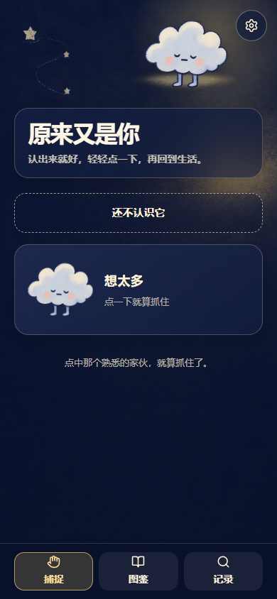
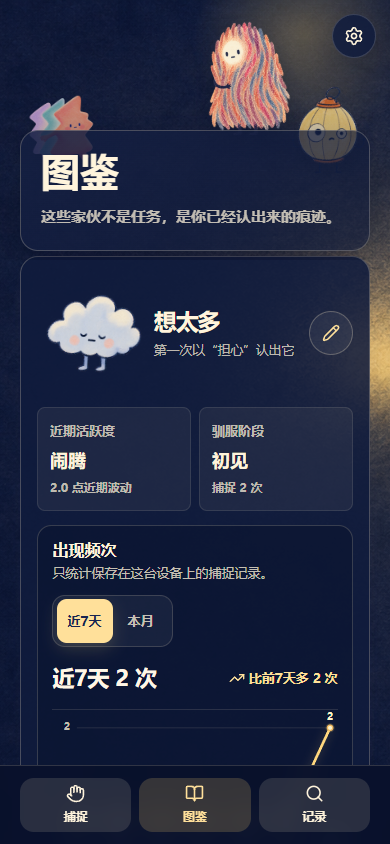
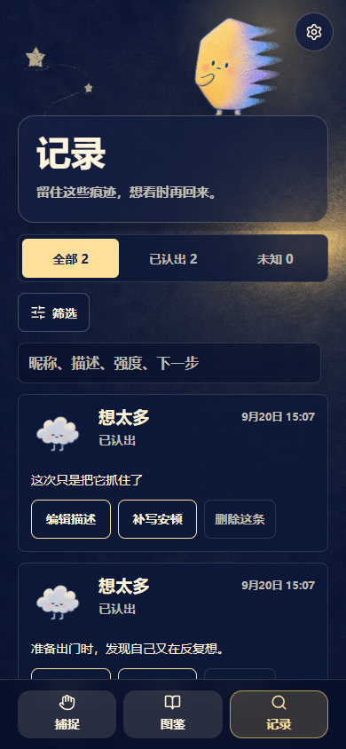
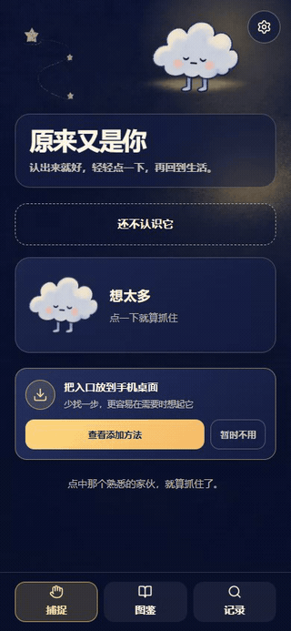

# 情绪宠物 · Emotion Pets

**原来又是你。认出情绪，轻轻记下，再回到生活。**

### [打开网站，开始体验 →](https://emotion-pet-app.pages.dev/)

移动端优先 · 无需注册 · 中英文 · 当前版本 1.0.1 · 公开试用中

情绪宠物是一个轻量的情绪觉察网页工具。当担心、烦躁、委屈，或说不清的感觉出现时，你可以给它选择一个小人、起一个自己的名字。下次认出它，点一下，就留下一次记录。

它不替你分析情绪，也不要求你马上变好。它想提供的是一个很短的停顿：**“我注意到这个感受了”，而不是急着被它带走。**

## 看一眼，再试试看

  
  
  

展开查看：一次轻轻的捕捉（有动画）

以上为 1.0.1 网页实拍，使用虚构示例资料。“想太多”只是示例昵称，不是角色的官方身份，也不代表某种诊断。

## 它可以帮你做什么？

- **把模糊的感受认出来。** 16 个形象由你选择；名字和含义也由你决定，没有固定情绪标签。
- **不用写长日记，也能留下痕迹。** 点一下就保存；描述、强度和下一步行动都可以稍后补，也可以不填。
- **在愿意的时候回看。** 查看记录和捕捉频次，留意自己保存过哪些时刻。频次不是情绪强度，没有记录也不代表没有情绪。
- **不用完成任务。** 没有打卡压力，不需要把每一次感受都记下来；捕捉之后，就可以回到生活。

## 背后的心理学，简单说

设计借鉴了三个概念，并把它们变成很短的日常练习：

1. **当下觉察**：先注意到“此刻我有什么感受”，不急着评判或消除它。
2. **情绪标记（affect labeling）**：尝试用一个词描述感受，让模糊体验有一个可辨认的线索。相关实验研究了把感受说出来与情绪反应之间的关系，但并不意味着每次命名都能让人好受。
3. **认知去融合（ACT 中的一个概念）**：练习看见念头，而不是自动把它当成事实或命令。这里借用“小人又出现了”的比喻，为观察情绪、选择下一步留一点空间；不是赶走或压抑情绪。

**这些是设计灵感，不是本产品的疗效证据。情绪宠物尚未经过临床效果验证，不是心理治疗、诊断或危机支持工具。** 如果痛苦持续影响生活，请寻求合格专业人士的支持；紧急危险时联系当地紧急服务。

想了解依据？这里有两份参考资料

- Lieberman et al. (2011), [Subjective Responses to Emotional Stimuli During Labeling, Reappraisal, and Distraction](https://doi.org/10.1037/a0023503)：情绪标记的实验研究，不能直接推导出本网站对个体的效果。
- Association for Contextual Behavioral Science：[About ACT](https://contextualscience.org/about_act)。ACT 包含接纳、认知去融合、当下觉察和有价值的行动等过程；本网站不是一套完整的 ACT 干预。

## 怎么开始？

1. 打开 [情绪宠物](https://emotion-pet-app.pages.dev/)，选择一个形象，给它取名。
2. 当那个熟悉的感觉出现，点击对应小人——顶部的小人也能捕捉。
3. 记录已保存；愿意就补几句话，不愿意就直接回到生活。

一时说不清也没关系，可以先保存未识别的记录，之后再认识它。

## 试用前，请知道

- 无需账号；宠物和情绪记录保存在**当前浏览器本地**，不会自动发送给开发者，也不会跨设备同步。
- 建议在设置中定期导出备份。换浏览器、清理浏览器数据、无痕使用或设备存储清理可能让记录无法保留；没有云端找回功能。
- **以后始终用同一个网址和原来的快捷方式。更新不需要重新添加快捷方式。** 设置里的版本检查可以帮助你确认更新。
- 反馈由你主动发送；邮件会让接收方看到邮件内容和发件地址，公开 GitHub Issue 则任何人都可能看到。不要附上私人情绪记录或完整备份。
- 更多说明：[体验与隐私](https://emotion-pet-app.pages.dev/privacy)。

## 欢迎告诉我：哪里顺手，哪里别扭？

[提交问题或建议](https://github.com/qq329388105-stack/emotion-pet-app-preview/issues/new/choose) · [复制反馈模板](FEEDBACK.md) · [邮件反馈](mailto:329388105@qq.com)

也可以直接用网站设置里的反馈入口，不需要 GitHub 账号。现在最想了解：第一次是否看得懂、16 个小人加载是否流畅、捕捉是否顺手，以及隔天回来记录是否还在。

## English · A tiny pause for emotional awareness

[Try Emotion Pets](https://emotion-pet-app.pages.dev/) — a mobile-first, local-first web app, available in Chinese and English. Choose a character, give it your own name and meaning, and tap when you notice that familiar feeling again. Add context if you want, then return to your day.

The design draws on present-moment awareness, affect labeling, and cognitive defusion: noticing and naming an experience without treating every thought as a fact or command. These are design inspirations, not evidence that this app is clinically effective. It is not therapy, diagnosis, or crisis support.

No account or cloud sync. Records stay in this browser; export a backup regularly and keep using the same website and home-screen shortcut. Screenshots use fictional data. [Send feedback](FEEDBACK.md), but never post private records or backup files in public issues.

---

本仓库用于公开展示与收集反馈，不包含应用源码；公开展示不等于授予角色素材或代码的开源许可。欢迎分享本页面和试用链接。
